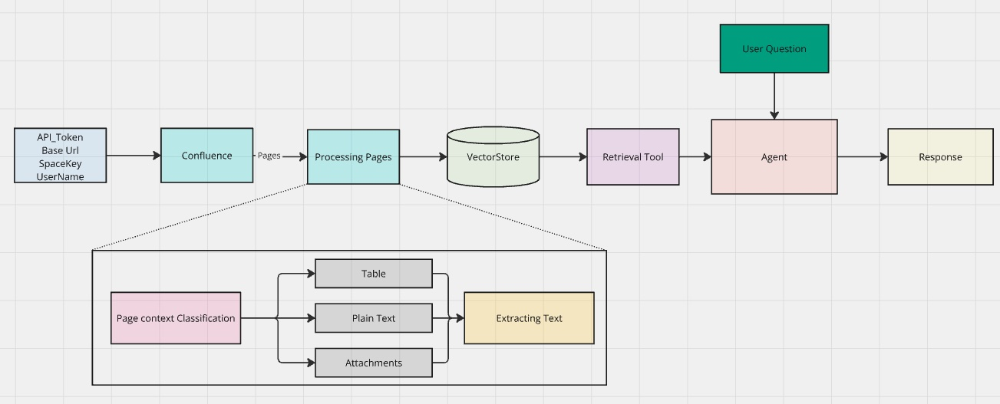

# Chatbot with Confluence Integration

## About the Project
This project is a chatbot that retrieves data from a Confluence space, including all pages, text, tables, and attachments. It stores this data in a vector database and uses it as a retrieval tool for answering user queries. The chatbot is hosted locally at `http://localhost:5000`.

## Features
- Extracts and stores Confluence page data in a vector database.
- Uses the stored data to respond to user queries efficiently.
- Supports text, tables, and attachments.
- Runs as a local application.

## Setup Instructions

### Prerequisites
Make sure you have Python installed on your system. You will also need to install the required dependencies and configure environment variables.

### Installation
1. Clone the repository:
   ```bash
   git clone <repository_url>
   cd <repository_folder>
   ```

2. Create a virtual environment (optional but recommended):
   ```bash
   python -m venv venv
   source venv/bin/activate  # On Windows, use `venv\Scripts\activate`
   ```

3. Install dependencies:
   ```bash
   pip install -r requirements.txt
   ```

4. Create a `.env` file in the project root and add the following environment variables:
   ```env
   API_TOKEN=<your_api_token>
   USERNAME=<your_confluence_username>
   BASE_URL=<your_confluence_base_url>
   SPACE_KEY=<your_confluence_space_key>
   OPENAI_API_KEY=<your_openai_api_key>
   ```

5. Run the application:
   ```bash
   python main.py
   ```

6. Access the chatbot at:
   ```
   http://localhost:5000
   ```

## Documentation

### Workflow Overview
The chatbot follows this process:
1. **Data Extraction**: Fetches data from the specified Confluence space, including text, tables, and attachments.
2. **Vector Storage**: Stores the extracted data in a vector database for efficient retrieval.
3. **Retrieval & Querying**: Loads the stored data as a retrieval tool for an agent, enabling users to ask questions about the documents.
4. **Response Generation**: The chatbot retrieves relevant content from the vector store and provides responses.

### Block Diagram


## Usage
- Start the application using `python main.py`.
- Ask questions related to the stored Confluence documents via the chatbot interface.
- The chatbot will search the vector store and return the most relevant information.

